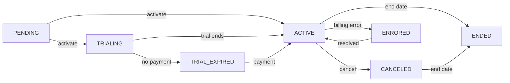

## Overview

A **Subscription** represents a customer's active agreement to a pricing plan. Subscriptions manage the relationship between customers, plans, and billing cycles, controlling when charges occur and invoices are generated.

## Subscription Data Model

Based on the proto definition at `modules/meteroid/proto/api/subscriptions/v1/models.proto:37-81`:

```protobuf
message Subscription {
  string id = 1;
  string customer_id = 2;
  string customer_name = 3;
  optional string customer_alias = 4;
  uint32 billing_day_anchor = 5;          // Day of month for billing
  string tenant_id = 6;
  string currency = 7;
  optional uint32 trial_duration = 8;     // Trial period in days
  string start_date = 9;
  optional string end_date = 10;
  string plan_id = 11;
  string plan_name = 12;
  string plan_version_id = 13;
  uint32 version = 14;                    // Plan version number
  uint32 net_terms = 17;                  // Payment terms
  optional string invoice_memo = 18;      // Note on invoices
  optional string activated_at = 20;
  uint64 mrr_cents = 23;                  // Monthly recurring revenue
  SubscriptionStatus status = 24;
  string local_id = 25;                   // Human-readable ID
  optional string billing_start_date = 26;
  bool pending_checkout = 36;             // Awaiting payment method
  
  // Billing cycle tracking
  optional string current_period_start = 37;
  optional string current_period_end = 38;
  int32 error_count = 39;
  optional string last_error = 40;
  optional string next_retry = 41;
}
```

## Subscription Status

Subscriptions progress through different states at `modules/meteroid/proto/api/subscriptions/v1/models.proto:27-35`:

```protobuf
enum SubscriptionStatus {
  PENDING = 0;         // Created but not yet active
  TRIALING = 1;        // In trial period
  ACTIVE = 2;          // Active and billing
  CANCELED = 3;        // Canceled, will not renew
  ENDED = 4;           // Completed or expired
  TRIAL_EXPIRED = 5;   // Trial ended, awaiting payment
  ERRORED = 6;         // Payment or billing error
}
```

### Status Transitions



## Creating Subscriptions

Create a subscription via the API at `modules/meteroid/proto/api/subscriptions/v1/models.proto:142-163`:

```protobuf
message CreateSubscription {
  string plan_version_id = 2;
  string customer_id = 3;
  optional uint32 trial_duration = 5;
  string start_date = 6;
  optional string end_date = 7;
  optional uint32 billing_day_anchor = 8;  // Day of month (1-31)
  optional uint32 net_terms = 10;          // Payment terms in days
  optional string invoice_memo = 11;       // Note for invoices
  optional string invoice_threshold = 12;  // Minimum amount to invoice
  optional string purchase_order = 13;     // PO number
  CreateSubscriptionComponents components = 14;
  CreateSubscriptionAddOns add_ons = 15;
  CreateSubscriptionCoupons coupons = 16;
  ActivationCondition activation_condition = 17;
  optional bool skip_past_invoices = 22;   // For migrations
}
```

### Activation Conditions

Control when subscriptions become active at `modules/meteroid/proto/api/subscriptions/v1/models.proto:165-169`:

```protobuf
enum ActivationCondition {
  ON_START = 0;      // Activate immediately at start_date
  ON_CHECKOUT = 1;   // Activate after successful payment
  MANUAL = 2;        // Manually activated via API
}
```

Example API call:

```bash
curl -X POST "https://api.meteroid.com/api/v1/subscriptions" \
  -H "Authorization: Bearer {api_token}" \
  -H "Content-Type: application/json" \
  -d '{
    "customer_id": "550e8400-e29b-41d4-a716-446655440000",
    "plan_version_id": "660e8400-e29b-41d4-a716-446655440001",
    "start_date": "2024-03-01",
    "billing_day_anchor": 1,
    "trial_duration": 14,
    "activation_condition": "ON_START"
  }'
```

## Billing Cycles

Subscriptions operate on recurring billing periods:

- **current_period_start**: Beginning of current billing cycle
- **current_period_end**: End of current billing cycle  
- **billing_day_anchor**: Day of month when billing occurs (1-31)

From the database schema at `modules/meteroid/crates/diesel-models/src/schema.rs`:

```rust
subscription (id) {
    billing_day_anchor -> Int2,
    current_period_start -> Date,
    current_period_end -> Nullable<Date>,
    cycle_index -> Nullable<Int4>,  // Current cycle number
}
```

### Billing Period Types

At `modules/meteroid/proto/api/subscriptions/v1/models.proto:295-301`:

```protobuf
enum SubscriptionFeeBillingPeriod {
  ONE_TIME = 0;      // Charged once
  MONTHLY = 1;       // Every month
  QUARTERLY = 2;     // Every 3 months
  YEARLY = 3;        // Every 12 months
  SEMIANNUAL = 4;    // Every 6 months
}
```

## Subscription Components

Subscriptions inherit price components from their plan, but can be customized.

At `modules/meteroid/proto/api/subscriptions/v1/models.proto:274-283`:

```protobuf
message SubscriptionComponent {
  string id = 1;
  optional string price_component_id = 2;
  optional string product_id = 3;
  string subscription_id = 4;
  string name = 5;
  SubscriptionFeeBillingPeriod period = 6;
  SubscriptionFee fee = 7;
  bool is_override = 8;  // Custom pricing for this subscription
}
```

### Component Customization

When creating a subscription, you can customize components at `modules/meteroid/proto/api/subscriptions/v1/models.proto:241-265`:

```protobuf
message CreateSubscriptionComponents {
  repeated ComponentParameterization parameterized_components = 18;  // Configure parameters
  repeated ComponentOverride overridden_components = 19;             // Custom pricing
  repeated ExtraComponent extra_components = 20;                     // Additional charges
  repeated string remove_components = 21;                            // Exclude components
}
```

**Parameterization** - Adjust configurable settings:
```protobuf
message ComponentParameterization {
  string component_id = 1;
  optional uint32 initial_slot_count = 2;      // Starting seat count
  optional BillingPeriod billing_period = 3;   // Override period
  optional uint64 committed_capacity = 4;      // Committed usage
}
```

**Override** - Replace pricing entirely:
```protobuf
message ComponentOverride {
  string component_id = 1;
  string name = 2;
  PriceEntry price = 3;  // New custom price
}
```

## Add-ons

Subscriptions can include optional add-ons at `modules/meteroid/proto/api/subscriptions/v1/models.proto:223-231`:

```protobuf
message SubscriptionAddOn {
  string id = 1;
  string add_on_id = 2;
  string subscription_id = 3;
  string name = 4;
  SubscriptionFeeBillingPeriod period = 5;
  SubscriptionFee fee = 6;
  uint32 quantity = 7;  // Number of add-on units
}
```

Add-ons are optional, purchasable extras like:
- Additional storage
- Premium support
- Extra API quota
- Custom integrations

## Slot-Based Subscriptions

For seat-based or license-based pricing, subscriptions track slot transactions.

At `modules/meteroid/proto/api/subscriptions/v1/models.proto:317-328`:

```protobuf
message SlotTransaction {
  string id = 1;
  string subscription_id = 2;
  string unit = 3;                 // e.g., "seats", "licenses"
  int32 delta = 4;                 // Change in slots (+3, -1, etc.)
  int32 prev_active_slots = 5;
  int32 new_active_slots = 6;
  string effective_at = 7;         // When change takes effect
  string transaction_at = 8;       // When transaction was created
  SlotTransactionStatus status = 9;
  optional string invoice_id = 10; // Associated invoice for upgrade
}
```

### Slot Upgrade Modes

At `modules/meteroid/proto/api/subscriptions/v1/models.proto:303-310`:

```protobuf
enum SlotUpgradeBillingMode {
  SLOT_OPTIMISTIC = 0;       // Activate immediately, invoice after
  SLOT_ON_CHECKOUT = 1;      // Payment first, activate on success
  SLOT_ON_INVOICE_PAID = 2;  // Activate when invoice is paid
}
```

## Trial Periods

Subscriptions can include trial periods from the plan configuration at `modules/meteroid/proto/api/subscriptions/v1/models.proto:84-89`:

```protobuf
message TrialConfig {
  uint32 duration_days = 1;                  // Length of trial
  bool is_free = 2;                          // Free or charged trial
  optional string trialing_plan_id = 3;      // Different plan features during trial
  optional string trialing_plan_name = 4;
}
```

During trials:
- Status is `TRIALING`
- Features can match a different plan (e.g., Enterprise trial for Standard plan)
- At trial end, transitions to `ACTIVE` or `TRIAL_EXPIRED`

## Scheduled Events

Subscriptions can have pending scheduled changes at `modules/meteroid/proto/api/subscriptions/v1/models.proto:102-116`:

```protobuf
enum ScheduledEventType {
  PLAN_CHANGE = 0;  // Switch to different plan
  CANCEL = 1;       // Cancel subscription
  PAUSE = 2;        // Pause billing
  END_TRIAL = 3;    // End trial early
}

message PendingScheduledEvent {
  string id = 1;
  ScheduledEventType event_type = 2;
  string scheduled_date = 3;
  optional string new_plan_name = 4;        // For plan changes
  optional string new_plan_version_id = 5;
  optional string cancel_reason = 6;        // For cancellations
}
```

## Subscription Lifecycle Operations

### Upgrade/Downgrade Plan

Schedule a plan change:
```bash
POST /api/v1/subscriptions/{id}/schedule-plan-change
{
  "new_plan_version_id": "...",
  "effective_date": "2024-04-01",
  "proration": true
}
```

### Cancel Subscription

Schedule cancellation:
```bash
POST /api/v1/subscriptions/{id}/cancel
{
  "cancel_at_period_end": true,  // or immediately
  "reason": "Customer request"
}
```

### Pause Subscription

Temporarily pause billing:
```bash
POST /api/v1/subscriptions/{id}/pause
{
  "resume_date": "2024-05-01"
}
```

### Add Slots

Increase seat count:
```bash
POST /api/v1/subscriptions/{id}/slots
{
  "component_id": "...",
  "delta": 3,  // Add 3 seats
  "effective_at": "immediate"
}
```

## MRR Calculation

Subscriptions automatically calculate Monthly Recurring Revenue (MRR) in cents:

- Normalizes all recurring charges to monthly value
- Annual plans are divided by 12
- Quarterly plans are divided by 3
- Usage-based components are estimated from historical usage
- One-time charges are excluded

```rust
// From schema
subscription (id) {
    mrr_cents -> Int8,  // Stored as cents to avoid decimal issues
}
```

## Error Handling

When billing or payment errors occur:

- `status` transitions to `ERRORED`
- `last_error` contains error message
- `error_count` increments
- `next_retry` schedules automatic retry

From the database at `modules/meteroid/crates/diesel-models/src/schema.rs`:

```rust
subscription (id) {
    status -> SubscriptionStatusEnum,
    error_count -> Int4,
    last_error -> Nullable<Text>,
    next_retry -> Nullable<Timestamp>,
}
```

## Migration Mode

When migrating existing subscriptions from another system:

```protobuf
message CreateSubscription {
  optional bool skip_past_invoices = 22;  // Skip historical invoice generation
}
```

Set `skip_past_invoices: true` to:
- Start subscription with past `start_date`
- Calculate correct `cycle_index` and periods
- Skip generating invoices for past cycles
- Begin invoicing from current period forward

## Best Practices

<AccordionGroup>
  <Accordion title="Set appropriate billing_day_anchor">
    Choose a billing day that aligns with customer expectations. 1st of month is common for B2B. Anniversary date works for B2C.
  </Accordion>
  
  <Accordion title="Use trial periods strategically">
    Offer trials for self-service plans to reduce friction. Consider 14-day trials for Standard plans, 30 days for Enterprise.
  </Accordion>
  
  <Accordion title="Handle cancellations gracefully">
    Default to `cancel_at_period_end: true` to let customers use their paid period. Immediate cancellation may require prorated refunds.
  </Accordion>
  
  <Accordion title="Monitor error_count">
    Set up alerts when subscriptions enter `ERRORED` state. Implement dunning campaigns to recover failed payments.
  </Accordion>
  
  <Accordion title="Schedule plan changes at period end">
    Plan upgrades/downgrades should typically occur at billing period boundaries to avoid complex proration logic.
  </Accordion>
</AccordionGroup>

## Related Concepts

<CardGroup cols={2}>
  <Card title="Pricing Plans" icon="tags" href="/concepts/pricing-plans">
    Understand plan structure and versioning
  </Card>
  <Card title="Customers" icon="users" href="/concepts/customers">
    Learn about customer management
  </Card>
  <Card title="Invoicing" icon="file-invoice-dollar" href="/concepts/invoicing">
    See how subscriptions generate invoices
  </Card>
  <Card title="Metering" icon="gauge" href="/concepts/metering">
    Track usage for usage-based subscription components
  </Card>
</CardGroup>