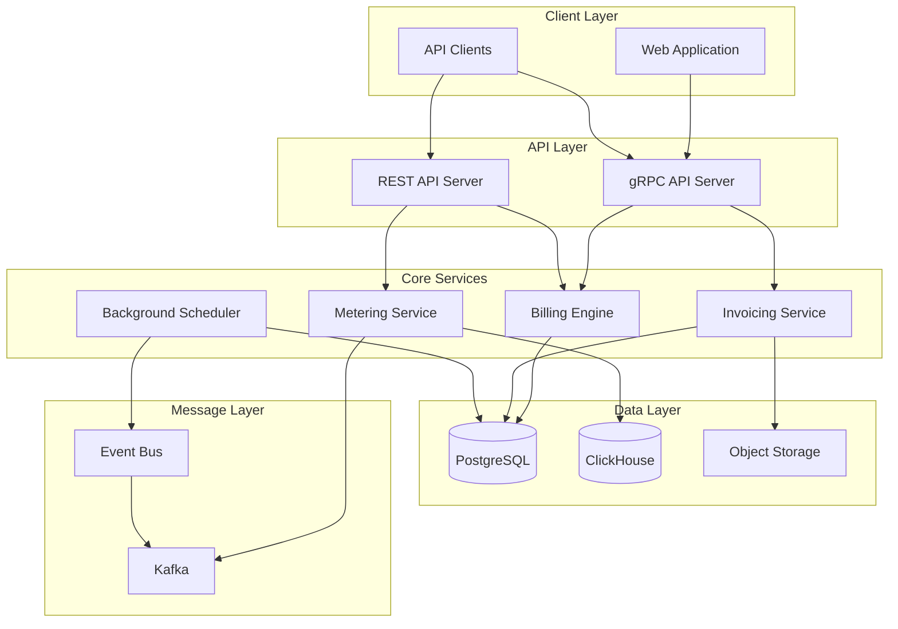

Meteroid is built with a modern, cloud-native architecture designed for scalability, reliability, and developer productivity.

## Technology Stack

### Backend

<CardGroup cols={2}>
  <Card title="Rust" icon="rust">
    Core backend language for performance and safety
  </Card>
  <Card title="Tokio" icon="bolt">
    Async runtime for high-concurrency workloads
  </Card>
  <Card title="PostgreSQL" icon="database">
    Primary database for transactional data
  </Card>
  <Card title="ClickHouse" icon="chart-column">
    Analytics database for metering events
  </Card>
</CardGroup>

### Communication

<CardGroup cols={2}>
  <Card title="gRPC" icon="network-wired">
    High-performance RPC using Protocol Buffers
  </Card>
  <Card title="REST API" icon="globe">
    HTTP/JSON API for external integrations
  </Card>
  <Card title="Kafka" icon="stream">
    Event streaming for usage metering
  </Card>
  <Card title="Tonic" icon="code">
    Rust gRPC framework
  </Card>
</CardGroup>

### Frontend

<CardGroup cols={2}>
  <Card title="React" icon="react">
    Modern UI framework
  </Card>
  <Card title="TypeScript" icon="code">
    Type-safe JavaScript
  </Card>
  <Card title="Vite" icon="bolt">
    Fast build tool and dev server
  </Card>
  <Card title="pnpm" icon="package">
    Efficient package manager
  </Card>
</CardGroup>

## System Architecture

Meteroid follows a modular architecture with clear separation of concerns:

## Module Structure

Meteroid is organized into three main modules:

### 1. Meteroid Module

The core billing and API module located in `modules/meteroid/`.

**Responsibilities:**
- Customer and subscription management
- Product catalog and pricing
- Invoice generation and finalization
- Payment processing
- REST and gRPC APIs
- Background job scheduling

**Key Components:**
- `src/api/` - gRPC service implementations
- `src/api_rest/` - REST API endpoints
- `src/services/` - Business logic layer
- `src/workers/` - Background job workers
- `crates/meteroid-store/` - Database access layer
- `crates/meteroid-invoicing/` - Invoice generation engine
- `crates/meteroid-grpc/` - gRPC type definitions

### 2. Metering Module

Usage metering and analytics module located in `modules/metering/`.

**Responsibilities:**
- Event ingestion from Kafka
- Usage aggregation and queries
- Meter configuration and management
- Real-time usage analytics

**Key Components:**
- `src/bin/server.rs` - Metering API server
- `crates/metering-grpc/` - gRPC service definitions
- ClickHouse schema and migrations
- Kafka consumer for event processing

**Features:**
- `clickhouse` - ClickHouse database connector
- `kafka` - Kafka event streaming

### 3. Web Module

Frontend application located in `modules/web/`.

**Structure:**
- `web-app/` - Main React application
- `packages/` - Shared UI components and libraries

**Technologies:**
- React 18+ with TypeScript
- Vite for build and dev server
- Turborepo for monorepo management
- Generated gRPC clients

## Workspace Crates

Meteroid uses a Cargo workspace to organize shared functionality:

### Common Crates (`crates/`)

Shared libraries used across modules:

| Crate | Purpose |
|-------|--------|
| `common-config` | Configuration management |
| `common-domain` | Shared domain models |
| `common-grpc` | gRPC utilities and middleware |
| `common-logging` | Observability and tracing |
| `common-eventbus` | Event-driven architecture |
| `common-utils` | Utility functions |
| `distributed-lock` | Distributed locking with Postgres |
| `kafka` | Kafka client wrapper |

### Meteroid Crates (`modules/meteroid/crates/`)

Billing-specific libraries:

| Crate | Purpose |
|-------|--------|
| `meteroid-grpc` | gRPC service definitions |
| `meteroid-store` | Database access layer (Diesel ORM) |
| `meteroid-invoicing` | Invoice generation and PDF rendering |
| `meteroid-mailer` | Email service (SMTP) |
| `meteroid-oauth` | OAuth integrations (Google, HubSpot) |
| `meteroid-tax` | Tax calculation engine |
| `meteroid-middleware` | HTTP/gRPC middleware |
| `meteroid-seeder` | Database seeding for development |
| `diesel-models` | Database schema and models |
| `stripe-client` | Stripe API client |
| `hubspot-client` | HubSpot API client |
| `pennylane-client` | Pennylane API client |

### Adapter Modules (`modules/adapters/`)

Third-party system integrations:

- `openstack/` - OpenStack usage collection
- `slurm-collector/` - SLURM cluster metering

## Binary Targets

Meteroid provides multiple binary executables:

### Meteroid Binaries

| Binary | Location | Purpose |
|--------|----------|--------|
| `meteroid-api` | `src/bin/server.rs` | gRPC/REST API server |
| `standalone` | `src/bin/standalone.rs` | Combined API + scheduler |
| `meteroid-scheduler` | `src/bin/scheduler.rs` | Background job processor |
| `openapi-generate` | `src/bin/openapi.rs` | OpenAPI spec generator |

### Metering Binaries

| Binary | Location | Purpose |
|--------|----------|--------|
| `metering-api` | `modules/metering/src/bin/server.rs` | Metering API server |

## Data Flow

### Billing Flow

1. **Customer onboarding** via API creates customer records in Postgres
2. **Subscription creation** links customers to pricing plans
3. **Usage events** are sent to Kafka for metering
4. **Scheduler** generates draft invoices periodically
5. **Invoice finalization** converts drafts to final invoices
6. **PDF generation** creates invoice documents stored in object storage
7. **Payment collection** integrates with Stripe or other gateways

### Metering Flow

1. **Events ingested** into Kafka topic `meteroid-events-raw`
2. **Metering consumer** reads events from Kafka
3. **Events stored** in ClickHouse for analytics
4. **Aggregation queries** compute usage metrics
5. **Billing integration** fetches usage for invoice calculation

## Database Schema

### PostgreSQL

Stores transactional data:

- **Tenants & Organizations** - Multi-tenancy support
- **Customers** - Customer records and metadata
- **Products & Plans** - Product catalog and pricing
- **Subscriptions** - Active customer subscriptions
- **Invoices** - Generated invoices and line items
- **Payments** - Payment records and status
- **Users & Auth** - Authentication and authorization

**Migration Tool:** Diesel

**Location:** `modules/meteroid/migrations/diesel/`

### ClickHouse

Stores high-volume event data:

- **Usage Events** - Raw metering events
- **Aggregated Metrics** - Pre-computed usage summaries
- **Meter Readings** - Periodic meter snapshots

**Migration Tool:** Refinery (via klickhouse)

**Location:** `modules/metering/migrations/`

## API Architecture

### gRPC API

**Protocol Buffers:** Defined in `proto/` directories

**Services:**
- Customer management
- Subscription lifecycle
- Product catalog
- Invoice operations
- Usage metering
- Analytics and reporting

**Features:**
- Type-safe API contracts
- Bi-directional streaming
- Code generation for multiple languages
- HTTP/2 performance

### REST API

**Framework:** Axum (Rust web framework)

**Documentation:** OpenAPI 3.0 (auto-generated)

**Location:** `modules/meteroid/src/api_rest/`

**Features:**
- OpenAPI/Swagger documentation
- JSON request/response
- HTTP/1.1 and HTTP/2
- CORS support

## Configuration

Meteroid uses environment variables for configuration:

**Key Configuration Files:**
- `.env.example` - Environment variable template
- `diesel.toml` - Diesel ORM configuration
- `buf.yaml` - Protocol Buffer build config
- `Cargo.toml` - Workspace dependencies

**Configuration Categories:**
- Platform secrets (JWT, encryption keys)
- API endpoints and ports
- Database connections (Postgres, ClickHouse)
- Message brokers (Kafka)
- External services (Stripe, email)
- Telemetry and observability

## Observability

### Logging

**Framework:** `tracing` + `tracing-subscriber`

**Levels:** ERROR, WARN, INFO, DEBUG, TRACE

**Output:** Structured JSON logs

### Tracing

**Protocol:** OpenTelemetry

**Instrumentation:**
- HTTP requests (axum-tracing-opentelemetry)
- gRPC calls (tonic-tracing-opentelemetry)
- Database queries
- Background jobs

**Export:** OTLP endpoint (Jaeger, Grafana Tempo, etc.)

### Metrics

**Format:** OpenTelemetry metrics

**Instrumentation:**
- Request counts and latencies
- Database connection pools
- Kafka consumer lag
- Custom business metrics

## Security

### Authentication

- JWT-based authentication
- OAuth 2.0 integrations (Google)
- API key authentication

### Authorization

- Multi-tenant isolation
- Role-based access control (RBAC)
- Organization-level permissions

### Data Protection

- Encryption at rest (database)
- TLS for all network communication
- Secret management via environment variables
- Encrypted fields in database (ChaCha20-Poly1305)

## Deployment Architecture

Meteroid supports multiple deployment models:

### Standalone Mode

Single binary deployment for development/testing:
- Combined API + scheduler
- Optional metering server
- Minimal infrastructure

### Distributed Mode

Production deployment with separated services:
- `meteroid-api` - Stateless API servers (horizontal scaling)
- `meteroid-scheduler` - Background job processor (single instance)
- `metering-api` - Usage metering API (horizontal scaling)
- Load balancer for API traffic

### Container Orchestration

- Docker Compose for local development
- Kubernetes (Helm charts) for production
- Health checks and readiness probes
- Horizontal pod autoscaling

## Performance Characteristics

### Rust Benefits

- **Zero-cost abstractions** - High performance without runtime overhead
- **Memory safety** - No garbage collection pauses
- **Concurrency** - Fearless concurrency with async/await
- **Small binaries** - Efficient resource utilization

### Scalability

- **Stateless API servers** - Easy horizontal scaling
- **Connection pooling** - Efficient database connections
- **Async I/O** - High concurrency with low memory
- **Event-driven architecture** - Decoupled components

### Optimization

- **Release builds** - Full compiler optimizations
- **Database indexing** - Optimized query performance
- **Caching** - Moka (in-memory) and Redis support
- **Batching** - Bulk operations for efficiency

## Development Tools

### Code Quality

- **Clippy** - Rust linter (`clippy.toml`)
- **rustfmt** - Code formatter
- **Diesel** - Type-safe database queries
- **ESLint** - JavaScript/TypeScript linting
- **Prettier** - Frontend code formatting

### Testing

- **Unit tests** - `cargo test`
- **Integration tests** - Testcontainers for Docker-based tests
- **Mocking** - Mockall for test doubles
- **Snapshot testing** - Insta for golden tests

### Build Tools

- **Cargo** - Rust build system and package manager
- **Turborepo** - Frontend monorepo build system
- **pnpm** - Node.js package manager
- **protoc** - Protocol Buffer compiler
- **buf** - Modern Protobuf tooling

## Next Steps

- Start [contributing](/development/contributing)
- Learn about [building from source](/development/building-from-source)
- Explore [deployment options](/deployment/overview)
- Review the [API documentation](/api-reference/overview)
