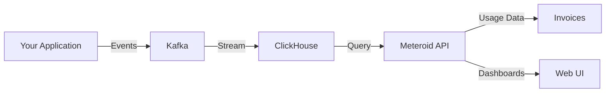

Meteroid's metering engine provides real-time tracking and aggregation of customer usage for accurate, transparent billing.

## Architecture



<CardGroup cols={2}>
  <Card title="High Throughput" icon="bolt">
    Ingest millions of events per day
  </Card>
  <Card title="Real-time" icon="clock">
    Query current usage instantly
  </Card>
  <Card title="Accurate" icon="bullseye">
    De-duplication and exactly-once processing
  </Card>
  <Card title="Scalable" icon="arrows-up-to-line">
    Built on ClickHouse for analytics at scale
  </Card>
</CardGroup>

## How Metering Works

<Steps>
  <Step title="Send Events">
    Your application sends usage events to Meteroid's metering API
  </Step>
  <Step title="Stream Processing">
    Events flow through Kafka for reliable, ordered processing
  </Step>
  <Step title="Storage">
    Events stored in ClickHouse for fast aggregation queries
  </Step>
  <Step title="Aggregation">
    Meteroid aggregates events based on billable metric configuration
  </Step>
  <Step title="Billing">
    Aggregated usage feeds into invoice generation
  </Step>
</Steps>

## Event Structure

Usage events contain:

```typescript
{
  "event_id": "evt_unique_123",           // Idempotency key
  "event_name": "api_request",            // Metric identifier
  "customer_id": "cust_abc",              // Who used it
  "timestamp": "2024-02-15T10:30:00Z",   // When it happened
  "properties": {                         // Event metadata
    "endpoint": "/v1/users",
    "method": "GET",
    "region": "us-east-1",
    "response_time_ms": 45,
    "status_code": 200
  }
}
```

## Billable Metrics

Define what to measure and how to aggregate it.

### Aggregation Types

<Tabs>
  <Tab title="COUNT">
    Count the number of events.
    
    **Example**: Count API requests
    ```typescript
    {
      "metric_name": "api_calls",
      "aggregation_type": "COUNT",
      "event_name": "api_request"
    }
    ```
  </Tab>
  
  <Tab title="SUM">
    Sum a numeric property across events.
    
    **Example**: Total compute hours
    ```typescript
    {
      "metric_name": "compute_hours",
      "aggregation_type": "SUM",
      "event_name": "compute",
      "aggregation_key": "duration_hours"
    }
    ```
  </Tab>
  
  <Tab title="MAX">
    Track the maximum value.
    
    **Example**: Peak concurrent connections
    ```typescript
    {
      "metric_name": "max_connections",
      "aggregation_type": "MAX",
      "event_name": "connection_count",
      "aggregation_key": "count"
    }
    ```
  </Tab>
  
  <Tab title="COUNT_DISTINCT">
    Count unique values.
    
    **Example**: Unique API consumers
    ```typescript
    {
      "metric_name": "unique_users",
      "aggregation_type": "COUNT_DISTINCT",
      "event_name": "api_request",
      "aggregation_key": "user_id"
    }
    ```
  </Tab>
</Tabs>

## Multi-dimensional Metering

Segment usage by dimensions for detailed billing:

**Example**: API calls by region and environment

```typescript
// Event with dimensions
{
  "event_name": "api_request",
  "properties": {
    "region": "us-east-1",
    "environment": "production"
  }
}

// Query usage by dimensions
const usage = await meteroid.usage.query({
  metric: "api_calls",
  group_by: ["region", "environment"]
});

// Result:
// us-east-1, production: 50,000 calls
// us-east-1, staging: 5,000 calls
// eu-west-1, production: 30,000 calls
```

## Idempotency

Prevent duplicate billing with idempotency keys:

<Info>
Use `event_id` to ensure each event is processed exactly once. If you send the same `event_id` twice, Meteroid ignores the duplicate.
</Info>

```typescript
// Send event with idempotency key
await meteroid.events.ingest({
  event_id: `user_123_login_${timestamp}`,
  event_name: "user_login",
  customer_id: "cust_abc"
});

// If you retry due to network error, duplicate is ignored
```

## Real-time Usage Queries

Query current usage at any time:

```typescript
// Get current month usage
const usage = await meteroid.usage.query({
  customer_id: "cust_abc",
  metric: "api_calls",
  start_date: "2024-02-01",
  end_date: "2024-02-29"
});

console.log(`Used ${usage.total} of 100,000 included calls`);
```

## Best Practices

<AccordionGroup>
  <Accordion title="Event Design">
    **Keep events focused**:
    - One event type = one billable action
    - Include all relevant dimensions in properties
    - Use consistent property names
    - Avoid nesting deeply (flatten properties)
    
    **Good**:
    ```json
    {"event_name": "api_request", "properties": {"endpoint": "/users"}}
    ```
    
    **Avoid**:
    ```json
    {"event_name": "request", "properties": {"api": {"path": "/users"}}}
    ```
  </Accordion>
  
  <Accordion title="Batching">
    **Send events in batches** for better performance:
    
    ```typescript
    // Batch 100 events per request
    const batch = [];
    for (const event of events) {
      batch.push(event);
      if (batch.length >= 100) {
        await meteroid.events.ingestBatch(batch);
        batch.length = 0;
      }
    }
    ```
    
    **Guidelines**:
    - Batch size: 100-1000 events
    - Flush interval: Every 5-10 seconds
    - Don't batch for hours (risk of data loss)
  </Accordion>
  
  <Accordion title="Error Handling">
    **Retry failed ingestion** with exponential backoff:
    
    ```typescript
    async function ingestWithRetry(event, retries = 3) {
      for (let i = 0; i < retries; i++) {
        try {
          return await meteroid.events.ingest(event);
        } catch (error) {
          if (i === retries - 1) throw error;
          await sleep(Math.pow(2, i) * 1000);
        }
      }
    }
    ```
    
    **Don't retry** client errors (400, 401, 403).
  </Accordion>
  
  <Accordion title="Backfilling">
    **Backfill historical usage** for migrations:
    
    ```typescript
    // Send events with past timestamps
    for (const historicalEvent of oldSystemData) {
      await meteroid.events.ingest({
        event_id: historicalEvent.id,
        event_name: "api_request",
        customer_id: historicalEvent.customer,
        timestamp: historicalEvent.created_at,  // Past date
        properties: historicalEvent.metadata
      });
    }
    ```
    
    Meteroid correctly attributes usage to the proper billing period.
  </Accordion>
</AccordionGroup>

## Use Cases

### API Monetization
Track API requests with detailed dimensions:
```typescript
metrics: [
  { name: "total_requests", type: "COUNT" },
  { name: "premium_endpoint_calls", type: "COUNT", filter: "endpoint = '/premium'" },
  { name: "total_response_time", type: "SUM", key: "response_time_ms" }
]
```

### Infrastructure Billing
Measure compute and storage usage:
```typescript
metrics: [
  { name: "compute_hours", type: "SUM", key: "duration_hours" },
  { name: "storage_gb_hours", type: "SUM", key: "gb_hours" },
  { name: "data_transfer_gb", type: "SUM", key: "bytes_transferred" }
]
```

### Feature Usage
Track specific feature consumption:
```typescript
metrics: [
  { name: "ai_credits", type: "SUM", key: "credits_consumed" },
  { name: "reports_generated", type: "COUNT" },
  { name: "unique_viewers", type: "COUNT_DISTINCT", key: "viewer_id" }
]
```

<CardGroup cols={2}>
  <Card title="Track Usage" icon="chart-line" href="/guides/tracking-usage">
    Learn how to implement usage tracking
  </Card>
  <Card title="Metering API" icon="code" href="/api/metering/overview">
    Explore the metering API reference
  </Card>
</CardGroup>